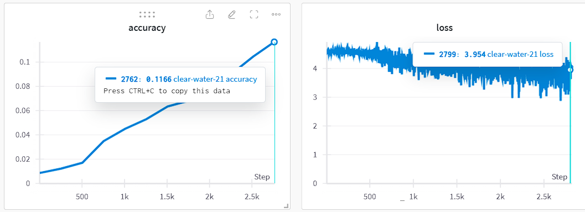

程式碼以colab執行

各項dataset數量:
    -trainset:45000
    -validset:5000
    -testset:10000

訓練結果：

各項正確率：
Accuracy of the network on the 10000 test images: 11 %
Accuracy of beaver : 37 %
Accuracy of dolphin : 13 %
Accuracy of otter :  6 %
Accuracy of  seal :  0 %
Accuracy of whale :  4 %
Accuracy of aquarium fish :  4 %
Accuracy of flatfish :  7 %
Accuracy of   ray : 16 %
Accuracy of shark :  0 %
Accuracy of trout : 30 %
Accuracy of orchids :  0 %
Accuracy of poppies :  0 %
Accuracy of roses :  0 %
Accuracy of sunflowers :  0 %
Accuracy of tulips :  3 %
Accuracy of bottles : 12 %
Accuracy of bowls :  0 %
Accuracy of  cans : 16 %
Accuracy of  cups : 42 %
Accuracy of plates :  0 %
Accuracy of apples :  6 %
Accuracy of mushrooms :  0 %
Accuracy of oranges :  5 %
Accuracy of pears : 30 %
Accuracy of sweet peppers : 26 %
Accuracy of clock :  0 %
Accuracy of computer keyboard :  0 %
Accuracy of  lamp : 18 %
Accuracy of telephone : 21 %
Accuracy of television :  0 %
Accuracy of   bed : 66 %
Accuracy of chair :  5 %
Accuracy of couch :  0 %
Accuracy of table :  0 %
Accuracy of wardrobe :  8 %
Accuracy of   bee :  7 %
Accuracy of beetle :  0 %
Accuracy of butterfly :  3 %
Accuracy of caterpillar : 17 %
Accuracy of cockroach :  7 %
Accuracy of  bear :  0 %
Accuracy of leopard : 40 %
Accuracy of  lion :  0 %
Accuracy of tiger : 37 %
Accuracy of  wolf :  0 %
Accuracy of bridge :  0 %
Accuracy of castle :  0 %
Accuracy of house : 26 %
Accuracy of  road : 34 %
Accuracy of skyscraper : 30 %
Accuracy of cloud :  0 %
Accuracy of forest :  4 %
Accuracy of mountain : 47 %
Accuracy of plain : 59 %
Accuracy of   sea : 21 %
Accuracy of camel :  0 %
Accuracy of cattle :  0 %
Accuracy of chimpanzee : 10 %
Accuracy of elephant :  0 %
Accuracy of kangaroo :  0 %
Accuracy of   fox : 58 %
Accuracy of porcupine :  8 %
Accuracy of possum :  0 %
Accuracy of raccoon :  0 %
Accuracy of skunk :  6 %
Accuracy of  crab : 17 %
Accuracy of lobster :  4 %
Accuracy of snail :  0 %
Accuracy of spider :  4 %
Accuracy of  worm :  4 %
Accuracy of  baby :  7 %
Accuracy of   boy :  0 %
Accuracy of  girl :  0 %
Accuracy of   man :  0 %
Accuracy of woman :  0 %
Accuracy of crocodile :  0 %
Accuracy of dinosaur : 40 %
Accuracy of lizard :  0 %
Accuracy of snake :  9 %
Accuracy of turtle :  0 %
Accuracy of hamster :  0 %
Accuracy of mouse :  0 %
Accuracy of rabbit : 14 %
Accuracy of shrew :  0 %
Accuracy of squirrel :  0 %
Accuracy of maple : 17 %
Accuracy of   oak : 20 %
Accuracy of  palm :  7 %
Accuracy of  pine :  4 %
Accuracy of willow : 31 %
Accuracy of bicycle :  3 %
Accuracy of   bus : 25 %
Accuracy of motorcycle : 80 %
Accuracy of pickuptruck :  0 %
Accuracy of train : 27 %
Accuracy of lawn-mower :  0 %
Accuracy of rocket : 18 %
Accuracy of streetcar :  3 %
Accuracy of  tank :  0 %
Accuracy of tractor :  5 %